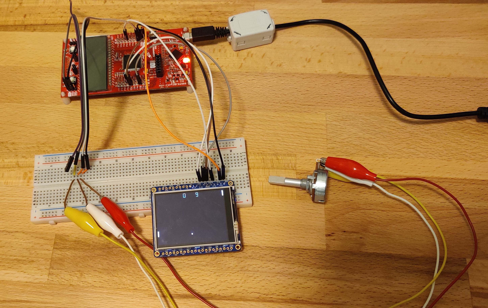

# MSP430FR6989 Paddle Game Project
This repository contains all necessary source files for a Pong clone that I created that targets the Texas Instruments MSP430FR6989 microcontroller hardware. The code is being run on a MSP430FR6989 LaunchPad Development Kit. A 10kiloohm potentiomer and an Adafruit 2.4" TFT 320x240 LCD screen were both connected to the microcontroller to read user input and display graphics to the user, respectively.

## Goals & Project Motivation

There are several reasons why I wanted to created this project: 

1. Regain familiarity with register access level microcontroller programming in C.
2. Practice reading through data sheets and reference documents to understand the architecture of microcontroller and LCD controller IC hardware used in the project. 
3. Gain knowledge of the Serial Peripheral Interface communication protocol and implement the protocol in a project.
4. Enjoy retro gaming programming.
5. Reduce looking at other's code and think critically about the software architecture to determine algorithms and data structures necessary for the project. 
6. Practice debugging by using step-through techniques and checking of register values at regular intervals.
7. Use an oscilloscope to analyze data packets being sent by SPI protocol.

## Files & Codebase

This project was created using the Code Composer Studio IDE which contained all necessary drivers and support files to develop code for the MSP430FR6989 micrcontroller on Windows 10. Several project files contained in this repository are generated and/or included by Code Composer Studio, and Texas Instruments retains all copyrights listed therein. The following project files contain code developed solely by myself:

 - adc.h
 - adc.c 
 - game.h
 - game.c
 - lcd.h
 - lcd.c
 - main.c
 - spi.h
 - spi.c

## Future Enhancements & Fixes

 - Continue to improve AI player logic algorithm
 - Utilize hardware timer to lock framerate and update sprites all at once 
 - Replace sprite draw functions with a single draw function where applicable
 - Create algorithm for updating only the pixels that have changed when updating sprites instead of re-writing entire sprite area 
 - Replace for loop delays with timer hardware delays
 - Standardize struct member access throughout code

## Technical Documents & References Utilized

- [MSP430FR6989 Family User's Guide](https://www.ti.com/lit/ug/slau367p/slau367p.pdf?ts=1610821013479)

- [MSP430FR6989 Reference Datasheet](https://www.ti.com/lit/ds/symlink/msp430fr6989.pdf?ts=1619463408267&ref_url=https%253A%252F%252Fwww.ti.com%252Fproduct%252FMSP430FR6989)

- [ILI9341 LCD Driver Chip Reference Document](https://cdn-shop.adafruit.com/datasheets/ILI9341.pdf)

- [Wikipedia SPI Page](https://en.wikipedia.org/wiki/Serial_Peripheral_Interface)

- [Sparkfun SPI Tutorial](https://learn.sparkfun.com/tutorials/serial-peripheral-interface-spi/all)

